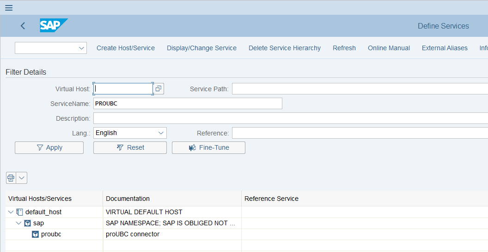
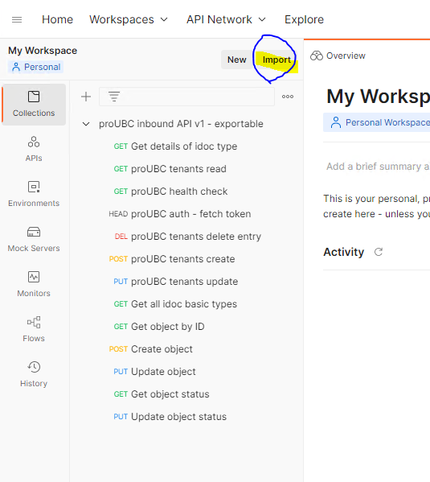
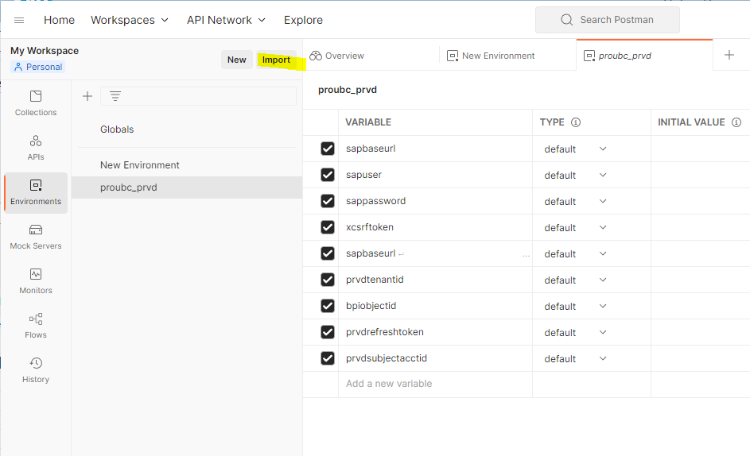
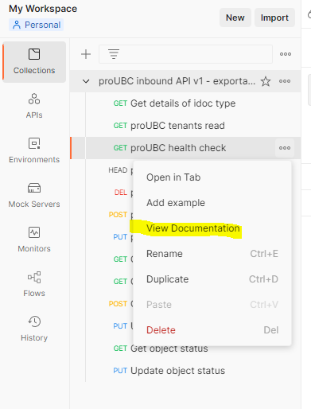

# proUBC Postman Collection

## About
Postman is used to define the REST API tests and expected inputs/outputs for the REST endpoint used to onboard PRVD users into S/4 HANA

You can download Postman from https://www.postman.com/downloads/

## Overview
Following the initial install and configuration of proUBC, you can use this API test suite along with PRVD CLI and shuttle to configure and test PRVD tenants as well as PRVD tenant's baseline protocol messages and object status updates

It is assumed you will test this API on SAP system with basic authentication, typically in an on-premise environment

Hint: Make sure the SICF node /sap/proubc is active! If text is grayed out - right click the proUBC node and select activate

## Importing the proUBC Inbound REST API Postman collection
See the provided proUBC Inbound Api.postman_collection file

To import it:
In Postman - select the 'Collections' tab. Select the 'Import' button and select the postman_collection file

You should see a list of the REST API tests after the import

## Postman Environment Variables
Below are the environment variables needed
| Variable Name | Description |
| :--           | :--         |
| sapbaseurl | External IP or host used for the SAP system |
| sapuser | the SAP user id |
| sappassword | the SAP user password |
| xcsrftoken | A temporary authentication token *required* for PUT, POST, and DELETE HTTP calls to SAP. This is passed with the X-CSRF-Token header. This is generated with a HEAD request to sapbaseurl/sap/proubc/auth. |
| prvdtenantid | A globally unique identifier for the PRVD organization |
| prvdsubjectaccountid | A globally unique identifier for the PRVD user |
| bpiobjectid | An id that may correspond to SAP sales order, purchase order, etc |
| prvdrefreshtoken | A JWT token for verified credentials provided by Ident. By default, the JWT shall expire every 30 days or earlier at user discretion. |

See the provided proubc_prvd_template.postman_environment file.

To import it into Postman:
In Postman - select the 'Environments' tab. Select the 'Import' button and select the postman_environment file

## Using the REST endpoints, documentation
Refer to the proUBC gitbook docs for complete info on using the REST endpoints along with the PRVD CLI.

Additional documentation on the API endpoints is provided within the requests in the Postman collection. Select the three dots next to the request in a collection to view documentation

## Version
Last update Oct 11 2022